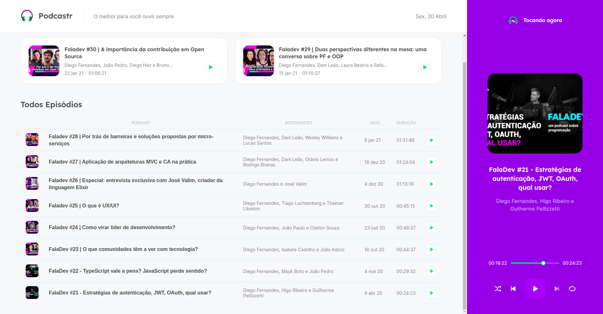

<h1 align="center">Welcome to Podcastr 👋</h1>
<p align="center">
  
</p>
<p>
  
  <a href="https://github.com/jeronimo-mz/nlw5-react#readme" target="_blank">
    
  </a>
  <a href="https://github.com/jeronimo-mz/nlw5-react/graphs/commit-activity" target="_blank">
    
  </a>
  <a href="./LICENSE" target="_blank">
    
  </a>
</p>

<p align="center">
  
</p>

> Podcastr is a Podcast broadcast platform focused on programming-related topics

## Install Dependecies

```sh
  yarn
```

## Usage

```zsh
  # run development Fake server
  yarn dev:server

  # run project
  yarn dev
```

open [http://localhost:3000](http://localhost:3000) on your browser.

## Author

👤 **Jerónimo A. Matavel Jr.**

-   Github: [@jeronimo-mz](https://github.com/jeronimo-mz)
-   LinkedIn: [@jeronimo-matavel](https://linkedin.com/in/jeronimo-matavel)

## 🤝 Contributing

Contributions, issues and feature requests are welcome!<br />Feel free to check [issues page](https://github.com/jeronimo-mz/nlw5-react/issues).

## Show your support

Give a ⭐️ if this project helped you!

## 📝 License

Copyright © 2021 [Jerónimo A. Matavel Jr.](https://github.com/jeronimo-mz).<br />
This project is [MIT](./LICENSE) licensed.
